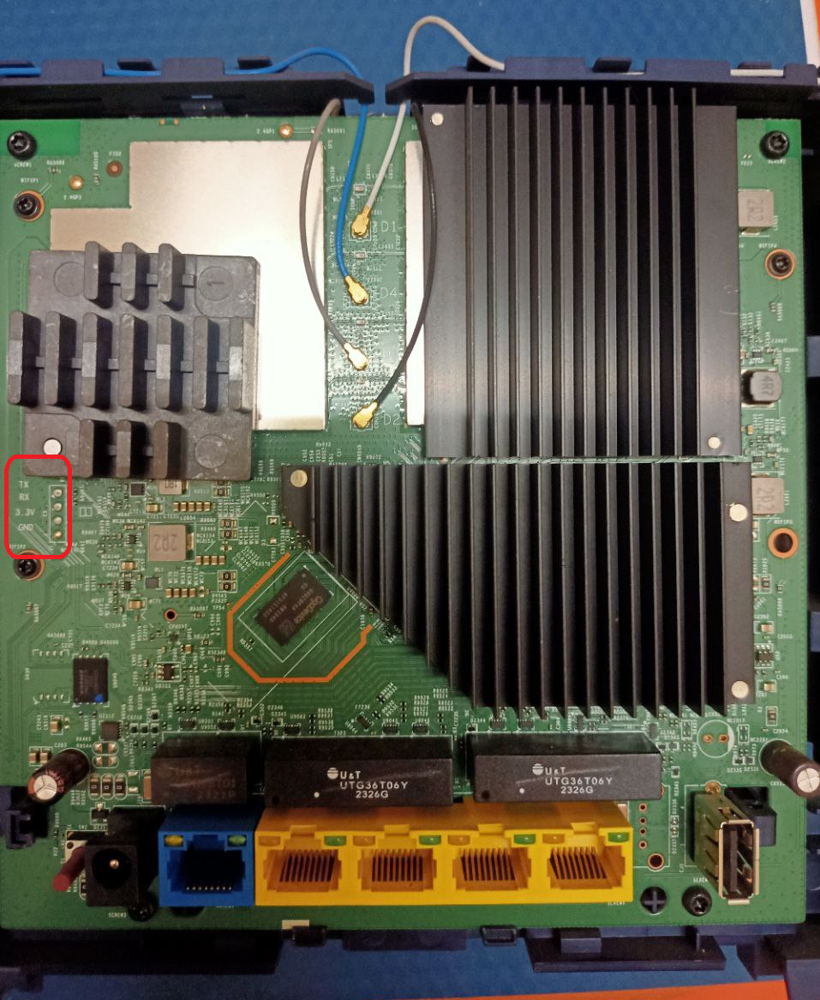

## 1. Strip apart the idu and find the 4 uart pins; usually marked on most models of idu. Some models have pins already soldered onto the pads so you don't have to.

## 2. Only connect Rx , Tx and GND ; do not connect 3.3v pin to your usb-to-ttl or whatever device you are using as a serial converter as it may fry your idu.

## 3. Install putty if you dont have a serial terminal already. use the configs below and connect the idu to your serial converter. 

## 4. power on the idu and see text starts flowing on your terminal. If you see garbled text then check your connections or try reversing the Rx Tx pins. 
# **🐮Configs:**   
BaudRate: 115200  
DataBits: 8  
StopBits: 1  
Parity: None  
FlowControl: None

# Note:
This has been tested on JIDU6801 and if you still encounter garbled text then maybe your model has a different baud rate; try using other common baud rates. Also your usb to ttl might be having issues so do check that.